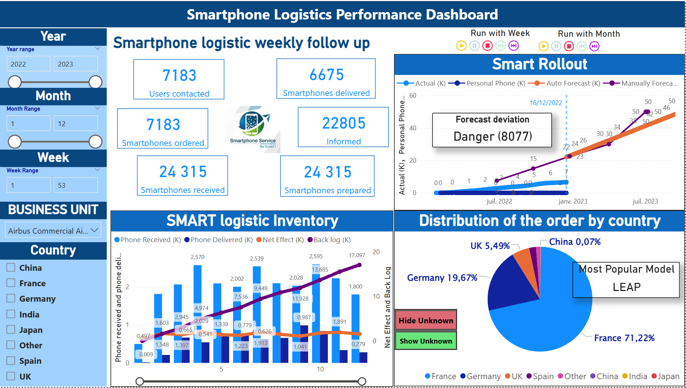

# Smartphone Logistics Performance Dashboard (End-to-End BI Project)

Single-page executive dashboard for SMART Service (Airbus context) to monitor smartphone logistics performance and rollout progress through weekly-refreshed KPIs.  
This project covers the full BI lifecycle end-to-end: **requirements → data modeling → Talend ETL → Oracle data mart → Power BI dashboard**. :contentReference[oaicite:1]{index=1}

---

## 1. Project Background
SMART Service supports Airbus employees with smartphone provisioning and operations (eligibility → selection → reception/configuration → appointment → delivery).  
The business requested an automated KPI dashboard to monitor team activity and performance, with governance and security constraints. :contentReference[oaicite:2]{index=2}

**Key requirements**
- **One-pager**: all KPIs on a single page (executive view). :contentReference[oaicite:3]{index=3}  
- **Weekly refresh** and historical tracking. :contentReference[oaicite:4]{index=4}  
- **Security / roles** separation (admin vs users) + SSO recommended. :contentReference[oaicite:5]{index=5}  
- **Data quality log** during integration (error visibility). :contentReference[oaicite:6]{index=6}  
- **Retention**: keep data for 2 years. :contentReference[oaicite:7]{index=7}  
- Filters: time range, country, and business unit. :contentReference[oaicite:8]{index=8}  

---

## 2. What I Built (Deliverables)
### A) Power BI Dashboard (KPI-Performance)
A single-page dashboard designed as an executive cockpit:
- **KPI 1 – Weekly logistics follow-up**: contacted, ordered, received, prepared, informed, delivered  
- **KPI 2 – SMART rollout follow-up**: actual vs forecast (manual/auto), deviation alert  
- **KPI 3 – Inventory / backlog**: stock in/out, net effect, cumulative backlog (K units)  
- **KPI 4 – Popular smartphone**: distribution by country + most popular model  
- **Interactive slicers**: Year / Month / Week + Business Unit + Country  
- **Run with Week / Run with Month**: playback controls that animate the timeline so **all visuals update dynamically** for demos and storytelling

### B) Data Mart in Oracle (Mag_SMART)
A centralized analytical store built to serve all KPI needs with consistent definitions:
- Dimensions: **Time**, **Business Unit**, **Country**
- Facts/measures aligned with KPI measurement dictionary (counts/sums for operational steps, stock movements, backlog, etc.) :contentReference[oaicite:9]{index=9}

### C) Automated ETL in Talend
A production-style pipeline to ingest, standardize, validate, and load weekly extracts from multiple repositories.

> **Important:** All components above (Talend jobs + Oracle data mart + Power BI model & dashboard) were designed and implemented by me end-to-end.

---

## 3. Data Sources
Operational data originates from three non-integrated repositories (weekly extracts): :contentReference[oaicite:10]{index=10}
- **BES**
- **SMART Portal**
- **Fleet** (shared directory exports)

---

## 4. Architecture Overview
**Data Flow**
1. Source files (BES / Portal / Fleet)  
2. **Talend ETL pipeline** (staging → standardization → cleansing → validation)  
3. **Oracle DW / Data Mart (Mag_SMART)**  
4. **Power BI** semantic model + measures + dashboard :contentReference[oaicite:11]{index=11}

---

## 5. ETL Pipeline (Talend) – Technical Highlights
### 5.1 Staging & Standardization
- Load delimited flat files into a staging area to preserve raw snapshots (auditability)
- Normalize formats (e.g., dates to consistent patterns; token parsing when fields contain extra characters)

### 5.2 Data Quality, Validation, and Reuse
- Handle common issues: nulls, inconsistent values, manual spelling errors
- Implement reusable **Java routines** inside Talend and call them in **tMap** for consistent rule enforcement
- Apply business rules required by reporting (e.g., week number derivation when missing) :contentReference[oaicite:12]{index=12}

### 5.3 Traceability & Lineage
- Track metadata: source system, file name, load timestamp, row counts
- Reconciliation checks between staging and curated layers to support lineage and audit

### 5.4 Error Logging & Exception Handling
- Row-level rejects (quarantine) with reason codes
- Job-level exception handling for schema mismatch/corrupted files/connection failures
- Integration requirement: **data quality log available during file integration** :contentReference[oaicite:13]{index=13}

### 5.5 Scheduling
- Weekly load cadence to meet refresh requirements (e.g., Monday morning schedule) :contentReference[oaicite:14]{index=14}

---

## 6. Data Model (Star Schema in Oracle / Semantic Layer)

The analytics layer is designed as a **star-schema oriented model** with a **conformed Date dimension** and multiple fact tables aligned to the SMART Service process steps (contact → selection → appointment → preparation/stock → delivery) and performance tracking. This structure enables consistent time slicing (Year/Month/Week), cross-filtering by Business Unit and Country, and reliable KPI aggregation.

### 6.1 Conformed Dimensions
- **DateTable (Dim_Date)**: Central time dimension used across the model  
  Fields include Date, Year, Quarter, Month Name/Number, Week Number, Day of Week.
- **BUSINESS_UNIT (Dim_BU)**: List of Airbus business units.
- **COUNTRY (Dim_Country)**: List of countries.
- **SMARTPHONE (Dim_Smartphone)**: Phone reference (Brand / Model).
- **COMPANY (Dim_Company)**: Company mapping (Business Unit ↔ CompanyName).
- **INSTALLNETWORK (Dim_InstallNetwork)**: Country-level installation network attributes (e.g., Home-to-Work).
- **EMPLOYEE (Dim_Employee)**: Employee reference attributes (eligibility flag, department, login id, etc.).

> Dimensions are kept reusable (“conformed”) so that KPIs from different process steps remain comparable under the same filters.

### 6.2 Fact Tables (Process & Performance)
The SMART Service workflow is captured through **multiple fact tables**, each representing a measurable step or dataset:
- **CONTACT (Fact_Contact)**: user contact events (`CONTACTED_ON`, Brand/Model, LoginID).
- **SELECTPHONE (Fact_SelectPhone)**: device selection events (`SMARTPHONE_SELECTED_ON`, Brand/Model, LoginID).
- **APPOINTEMENT (Fact_Appointment)**: appointment scheduling events (`APPOINTMENT_SCHEDULED_ON`, Brand/Model, LoginID).
- **DELIVERY (Fact_Delivery)**: delivery events (`DELIVERY_DATE`, `DELIVERY_WEEK`, Brand/Model, LoginID).
- **STOCK_IN / STOCK_OUT (Fact_StockIn / Fact_StockOut)**: inventory movements and preparation/receipt quantities (weekly granularity, Brand/Model).
- **PERFORMANCE_MD (Fact_Performance)**: KPI-performance dataset at Date × BU × Country grain (e.g., Actual and Personal Phone measures).
- **Auto forecast / Manually forecast (Fact_Forecast)**: forecast measures by date/week/year to support rollout monitoring and deviation alerts.
- **BUDATECOUNTRY (Bridge/Fact_BUDateCountry)**: helper table at BU × Country × Date grain used to standardize filtering and reporting consistency where needed.

### 6.3 Relationships & Reporting Behavior
- **DateTable** acts as the primary filter for all time-based facts (monthly/weekly slicing).
- **COUNTRY** and **BUSINESS_UNIT** provide consistent organizational slicing across performance and operational facts.
- **SMARTPHONE (Brand/Model)** enables the “Most Popular Model” KPI and device-level analysis.
- Employee/Company/InstallNetwork tables enrich slicing and support governance-friendly segmentation without duplicating attributes in fact tables.

### 6.4 Why this Model Works for the Dashboard
This schema supports:
- End-to-end KPI tracking along the SMART process (contacted → selected → appointment → prepared/stock → delivered)
- Inventory/backlog analytics through stock in/out + delivery flows
- Rollout monitoring through actual vs forecast tables
- Consistent filtering by time range (Year/Month/Week), Business Unit, and Country
- Scalable extension (new process steps or KPIs can be added by introducing a new fact table without breaking existing measures)

---

## 7. Power BI Model & Reporting Layer
- Connect Power BI to the curated **Mag_SMART** data mart
- Build measures for KPIs (including K-unit scaling) and ensure consistent definitions
- Apply unified look & feel (single-page cockpit) and interactive filtering
- Provide dynamic playback with **Run with Week / Run with Month** for presentation-mode analytics

---

## 8. Files in This Repository
- `kpi-overview.png` — dashboard screenshot preview  
- `smartphone-logistics-dashboard.pdf` — PDF export for quick viewing (recommended)  
- `smartphone-logistics-dashboard.pbix` — Power BI source file (optional)  
- `Dossier_conception_Yiming-GUI.docx` — functional & technical design document (project specification) :contentReference[oaicite:16]{index=16}

---

## 9. Notes (Refresh & Credentials)
The original academic/enterprise setup referenced an Oracle environment and controlled credentials.  
If you open the PBIX, **refresh may fail or prompt for login; please refer to the PDF instead.**

---

## 10. Role Fit
This project demonstrates end-to-end capability across:
- **Data Analyst**: KPI design, business rules, dashboard storytelling, stakeholder needs translation  
- **Pipeline / BI Engineer**: ETL automation, data quality, logging/traceability, dimensional modeling, data mart delivery

---
